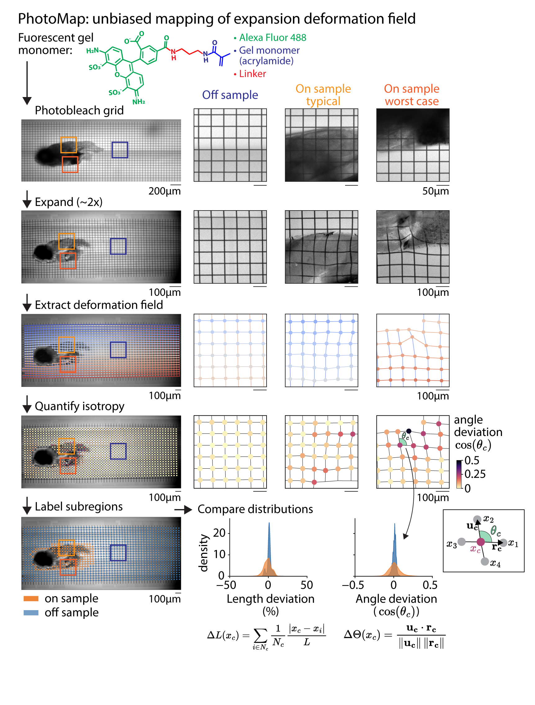

# PhotoMap

Photomap processing scripts for image analysis.



## Motivation
To quantify deformation introduced by expansion in a less biased manner, we developed PhotoMap, a method that measures the gel’s deformation field from a pre-imposed reference pattern. A regular grid is photobleached into the sample prior to expansion and re-imaged afterwards, enabling straightforward visualization and quantification of spatial distortions.

## Protocol

The experimental protocol for generating photomap data can be found at:
[https://dx.doi.org/10.17504/protocols.io.dm6gp9wxjvzp/v4](https://dx.doi.org/10.17504/protocols.io.dm6gp9wxjvzp/v4)

## Installation

Install directly from GitHub:

```bash
pip install git+https://github.com/vruetten/PhotoMap.git
```

Or clone and install locally:

```bash
git clone https://github.com/vruetten/PhotoMap.git
cd PhotoMap
pip install -e .
```

## Usage

```python
import photomap
from photomap import utils, find_grid, plot_results

```

## Dependencies

- numpy
- scipy
- matplotlib
- scikit-image
- tifffile
